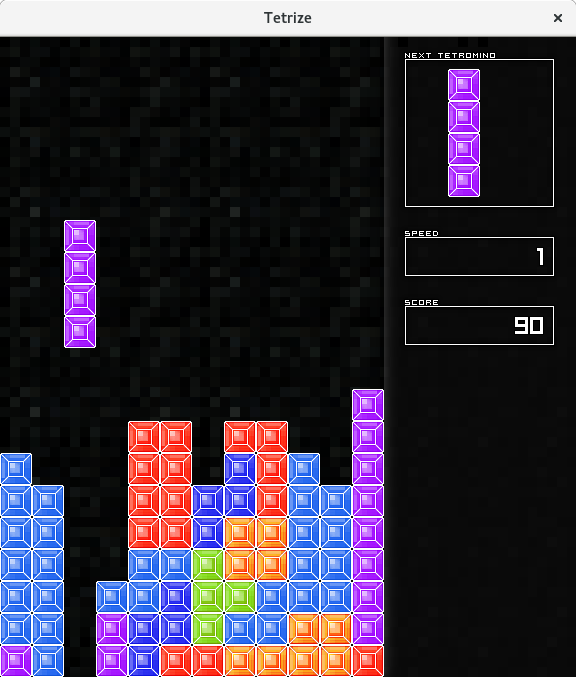

TETRIZE
=======

Tetrize is an implementation of the famous Tetris game, in Java.

How to Build and launch Tetrize:
--------------------------------

* First install the Java Development Kit (OpenJDK 6 works fine).

* Then just type the following command to build the game::

    $ make

* to start Tetrize, uses the following command::

    $ java -jar tetrize.jar

How to Play:
------------

::

    .

                <Left>  Move the tetromino to the left.
               <Right>  Move the tetromino to the right.
       <Up> or <Space>  Rotate the tetromino.
                <Down>  Speed-up.

              <Escape>  Pause

    <Space> or <Enter>  New game (on Game Over screen only)

Copyright:
----------

::

    src/*
        Copyright (C) 2012  Fabien LOISON <flo at flogisoft dot com>

    src/com/flogisoft/tetrize/res/*
        Copyright (C) 2011  Adrien VIGNERON <adrienvigneron at mailoo dot org>
        Copyright (C) 2012  Fabien LOISON <flo at flogisoft dot com>
